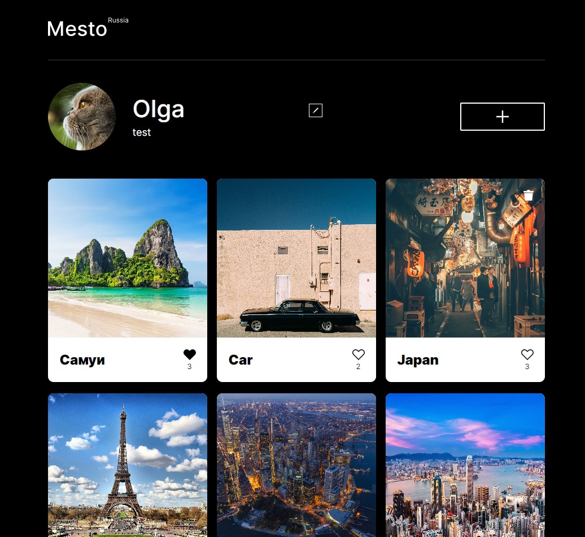

# Mesto

Проект по созданию итерактивной страницы Mesto, куда можно добавлять фотографии, удалять их и ставить им лайки, также есть возможность редактирования профиля.

Проект доступен по [**адресу**](https://kovolga.github.io/mesto-project/).

Статус: завершен.

## Стек технологий

## Главная страница

## Возможности:

- При нажатии на иконку **пера** появляется модальное окно, в котором можно редактировать информацию о пользователе в полях формы «Имя» и «О себе».
- Реализована валидация перед отправкой форм.
- При загрузке страницы добавляются последние карточки мест в галлерею.
- При нажатии на кнопку **«+»** появляется модальное окно с формой, в которой можно ввести название нового места и вставить ссылку на новую фотографию.
- При клике на **«сохранить»** новая карточка попадает в начало галлереи.
- При нажатии на фото появляется модальное окно, в котором можно увидеть фото полностью вместе с подписью.
- Все модальные окна закрываются кликом на крестик, клавишей Esc, кликом на оверлей.
- Фотографии можно удалять при нажатии на иконку **корзины** и ставить им лайки при нажатии на иконку **сердечка**.

Проект был выполнен в соответствии с предоставленным Яндекс Практикумом
[макетом](https://www.figma.com/file/2cn9N9jSkmxD84oJik7xL7/JavaScript.-Sprint-4?node-id=0%3A1).
